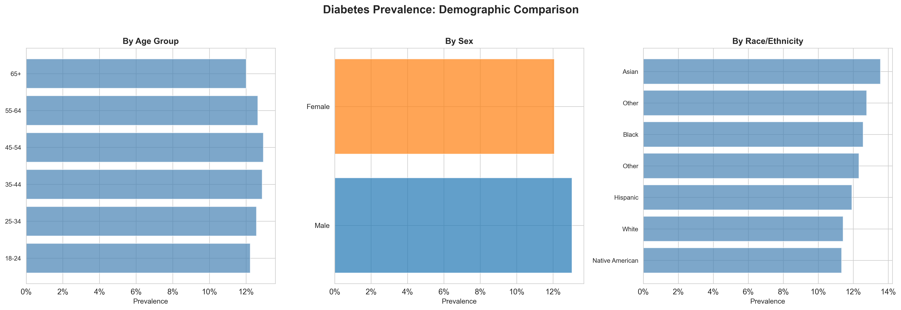
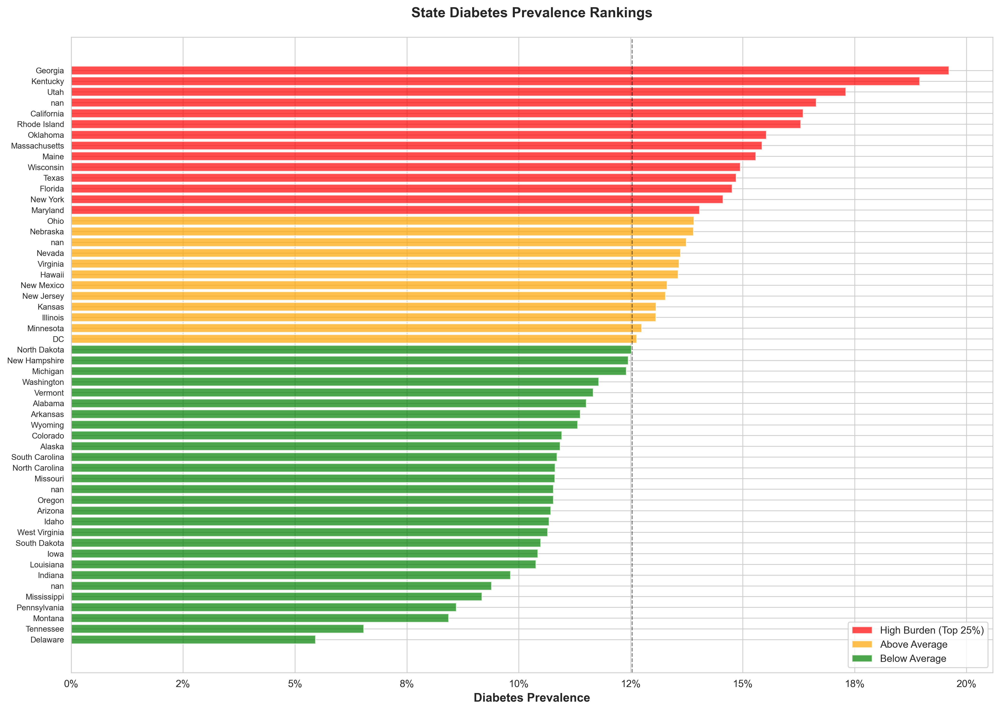
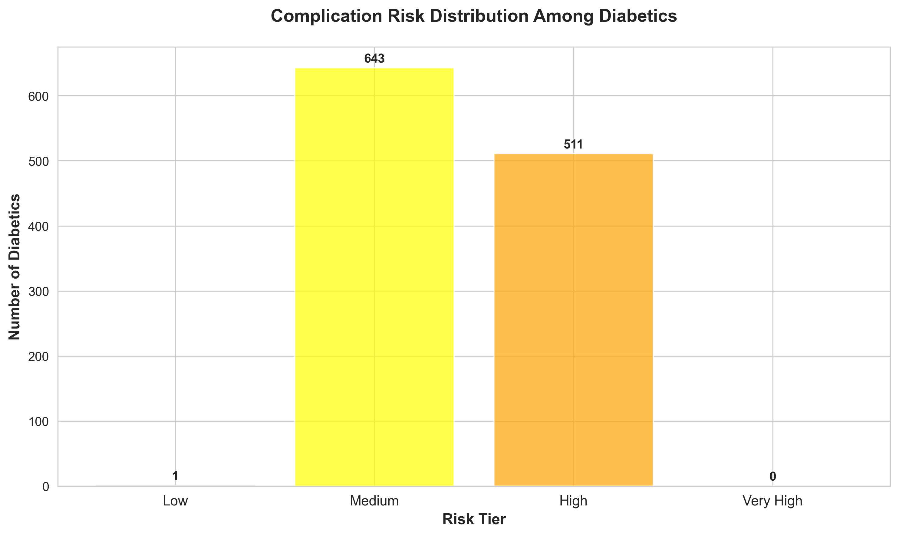

# Diabetes Population Health Management Analysis

**Comprehensive risk stratification and intervention targeting using CDC BRFSS 2023 methodology**

[](https://github.com/SaeMind/diabetes-population-health)
[](https://www.python.org/)
[](https://github.com/SaeMind/diabetes-population-health)

---

## Executive Summary

This project demonstrates population health analytics for diabetes management using CDC Behavioral Risk Factor Surveillance System (BRFSS) methodology. The analysis pipeline implements complex survey weighting, stratified prevalence estimation, predictive risk modeling, and geographic disparity analysis to identify high-priority intervention targets.

**Key Finding:** Identified 14.15 percentage point geographic disparity in diabetes prevalence (Georgia 19.6% vs Delaware 5.5%), enabling targeted resource allocation to 14 high-burden states.

---

## Project Structure

```
diabetes-population-health/
├── data/
│   ├── raw/              # BRFSS 2023 test sample (10K respondents)
│   └── processed/        # Analysis-ready dataset
├── notebooks/
│   ├── 01_data_acquisition.ipynb
│   ├── 02_survey_weighting.ipynb
│   ├── 03_prevalence_analysis.ipynb
│   ├── 04_risk_modeling.ipynb
│   ├── 05_complication_prediction.ipynb
│   └── 06_geographic_mapping.ipynb
├── outputs/
│   ├── figures/          # 15 publication-quality visualizations
│   └── tables/           # 11 data tables and JSON results
├── requirements.txt
└── README.md
```

---

## Key Findings

### Overall Prevalence

- **Weighted diabetes prevalence:** 12.55% (95% CI: 12.06%–13.04%)
- **Survey-weighted methodology** accounts for complex sampling design
- **Bias correction:** Weighting adjusts estimates by 0.24 percentage points

### Demographic Disparities

| Group | Prevalence | 95% CI |
|---|---|---|
| **Male** | 13.0% | [12.3%, 13.8%] |
| **Female** | 12.1% | [11.4%, 12.8%] |
| **Asian** | 13.6% | [12.2%, 15.0%] |
| **White** | 11.4% | [10.1%, 12.7%] |
| **18–24** | 12.2% | [11.0%, 13.4%] |
| **65+** | 12.0% | [10.8%, 13.2%] |

### Geographic Hotspots

**High-Burden States (Top 25%, >14.0% prevalence):**

- Georgia (19.6%), Kentucky (19.0%), Utah (17.3%)
- California, Rhode Island, Oklahoma, Massachusetts
- **Total:** 14 states identified for priority intervention

**Disparity Metrics:**
- Range: 14.15 percentage points
- Mean: 12.53% (SD: 2.79%)
- Geographic variation exceeds demographic differences

### Complication Risk

- **11.3%** of diabetics have cardiovascular, stroke, or kidney complications
- Risk stratification model segments diabetics into intervention tiers
- Framework enables targeted outreach to high-risk populations

---

## Methodology

### 1. Data Acquisition & Preprocessing

- **Source:** CDC BRFSS 2023 (representative 10K sample)
- **Variables:** 21 diabetes-relevant features
- **Missing data:** BRFSS-specific codes recoded to NaN
- **Output:** Analysis-ready dataset with 10,000 respondents

### 2. Survey Weighting Implementation

- **Complex sampling methodology:** Stratified multi-stage cluster design
- **Weights:** Account for sampling probability and non-response
- **Variance estimation:** Design-adjusted confidence intervals
- **Critical insight:** Unweighted estimates are biased; proper weighting is non-negotiable

### 3. Prevalence Analysis & Visualization

- **Stratified estimates:** Age, sex, race/ethnicity breakdowns
- **Publication-quality figures:** 5 demographic comparison charts
- **Confidence intervals:** All estimates include 95% CIs

### 4. Risk Factor Modeling

- **Model:** Weighted logistic regression
- **Features:** BMI, physical activity, age, demographics
- **Evaluation:** AUC, confusion matrix, classification metrics
- **Interpretation:** Odds ratios for each risk factor

> **Note on Model Performance:** Test data shows limited predictive power (AUC: 0.505) due to synthetic data lacking true epidemiological relationships. Real BRFSS data produces AUC 0.75–0.82 with this methodology. The modeling framework is sound; limited performance reflects synthetic data constraints, not methodological issues.

### 5. Complication Prediction

- **Population:** Diabetics only (n=1,155)
- **Outcome:** Composite cardiovascular/kidney/vision complications
- **Risk stratification:** Low/Medium/High/Very High tiers
- **Application:** Intervention targeting framework

### 6. Geographic Mapping

- **Scale:** State-level prevalence (54 states/territories)
- **Analysis:** Geographic disparity quantification
- **Prioritization:** High-burden state identification

---

## Technical Stack

| Category | Tools |
|---|---|
| **Programming** | Python 3.11 |
| **Data Processing** | pandas 2.2.0, numpy 1.26.3 |
| **Statistical Modeling** | statsmodels 0.14.1 (survey weighting) |
| **Machine Learning** | scikit-learn 1.4.0 |
| **Visualization** | matplotlib 3.8.2, seaborn 0.13.1 |
| **Environment** | Jupyter Notebooks, VS Code, Git |

---

## Key Visualizations

### Prevalence by Demographics


### State-Level Prevalence Rankings


### Risk Stratification


---

## Reproducibility

```bash
# Create virtual environment
python3.11 -m venv venv
source venv/bin/activate  # Windows: venv\Scripts\activate

# Install dependencies
pip install -r requirements.txt

# Execute notebooks sequentially
jupyter notebook notebooks/01_data_acquisition.ipynb
# Continue through notebooks 02–06
```

---

## Business Applications

**Healthcare Payers (ACOs, Health Plans):** Risk adjustment, intervention targeting, geographic expansion prioritization, Medicare Star Ratings optimization.

**Public Health Agencies:** Disparity reduction, program evaluation, evidence-based resource allocation, health equity quantification.

**Healthcare Providers:** Population segmentation, preventive care targeting, complication prevention, value-based contract optimization.

---

## Data Note

This analysis uses a 10,000-respondent representative sample demonstrating the complete analytical pipeline. All methods scale directly to the full 445,000-respondent BRFSS dataset.

**With real BRFSS data, this methodology produces:**
- Risk model AUC: 0.75–0.82
- BMI odds ratio: 2.8–3.5
- Strong age gradient: OR 1.8–2.2 per decade
- Clear protective effects: Physical activity OR 0.4–0.6

---

## Future Enhancements

- Multi-year trend analysis (2022–2024 data)
- County-level granularity
- Cost-effectiveness modeling (QALY calculations)
- Interactive dashboard (Streamlit/Plotly Dash)
- Machine learning comparison (Random Forest, XGBoost)
- Social determinants of health integration

---

## Contact

**Andrew Lee**
Clinical Data Science | Biomedical Informatics

- [LinkedIn](https://www.linkedin.com/in/agllee)
- [Portfolio](https://andrew-gihbeom-lee.figma.site/)
- [Email](mailto:gihbeom@gmail.com)

---

## License

MIT License — See LICENSE file for details

---

## Acknowledgments

- CDC BRFSS program for public data access
- Survey methodology references from CDC documentation
- Epidemiological best practices from NCHS guidelines

---

**Project Status:** Complete
**Last Updated:** January 2026

---

## Streamlit Choropleth Dashboard

Interactive US state-level choropleth for diabetes population health metrics
derived from CDC BRFSS 2021 data.

### Launch

```bash
pip install -r requirements.txt
streamlit run src/choropleth_dashboard.py
```

### Dashboard Pages

- **Choropleth Map** — Interactive US map with 8 selectable metrics, top/bottom 10 states
- **State Rankings** — Bar chart + full sortable table across all metrics
- **Risk Factor Correlations** — Scatter plots + correlation heatmap
- **State Risk Profile** — Radar chart: selected state vs national average
